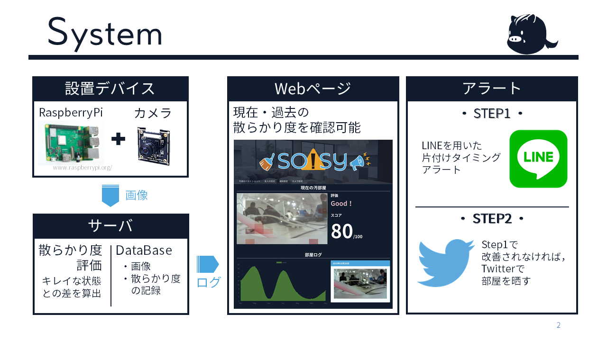

# SOISY

## 製品概要
### 掃除 X Tech

### 背景（製品開発のきっかけ、課題等）

- こんかいのプロダクトの開発に至った背景
片づけの習慣を身につけるということは幼少期から少年期に終えておくべきプロセスですが、
これを果たせていない人が一定数存在することは明らかです。
こういった人たちに親の庇護を受けるファーストチャンスに得ておくべき資産を得るセカンドチャンスを提供したいという思いからこのプロダクトの必要性を見出しました。

- 着目した顧客・顧客の課題・現状
共働きが増えた時代で子供に片付け習慣を付けさせたい家族
子供時代に片付けの習慣が付かなかった大人

### 製品説明（具体的な製品の説明）
部屋の状態を数十分おきに確認し、どの程度散らかっているか評価します。
評価の結果、十分に散らかっていると判断されればアラートが飛びます。

### 特長

#### 1. 人間が判断するよりも細かく部屋の散らかりを判断する画像診断システム
部屋が完全に散らかりきり、手遅れになる前、片付けが厄介になる前に掃除を開始できます。
戦略的に掃除する事が可能となり、巷に溢れる片付け術といった戦術的な技術が必要なくなります。

#### 2. 導入が容易
Raspberry piとカメラという少数のコンポーネントで構成されており、壁に取り付けるだけ。
アプリを落とす必要もなく、好きなブラウザから各種設定が可能です。

#### 3. 強力な強制力をともなうアラート
長い間掃除がされなければ、Soisyは実力を行使します。
LINEでの通知に始まり、最終的には汚部屋をTwitterに晒し上げるに至ります。

### 解決出来ること
片づけの習慣を身につけるべき年齢の子どもや、幼少期に片づけの習慣がつかなかった大人に片づけの習慣を付ける事ができます。
部屋の散らかり具合に基づいた戦略的な掃除の実行が提案されます。

### 今後の展望
未実装の機能
* ユーザーのアカウント情報や汚れ具合を通知する閾値設定、等の初期登録
* 各プロセスの連携が部分的に未実装

将来的な機能拡張の展望
* LEDや警報音による通知
* 顔認証によって、誰が汚したのかを検知する（シェアスペースでの利用想定）

## 開発内容・開発技術

### 活用した技術
#### API・データ
今回スポンサーから提供されたAPI、製品などの外部技術があれば記述をして下さい。

* LINE Messaging API
* AWS
* IFTTT

#### フレームワーク・ライブラリ・モジュール
* MySQL
* gin (golang)
* slim (php)
* bulma (css)
* openCV

#### デバイス
* Raspberry pi
* カメラ

### 研究内容・事前開発プロダクト（任意）
ご自身やチームの研究内容や、事前に持ち込みをしたプロダクトがある場合は、こちらに実績なども含め記載をして下さい。

* なし

### 独自開発技術（Hack Dayで開発したもの）
#### 2日間に開発した独自の機能・技術
* Raspberry Pi に接続したカメラからの部屋画像をAWS上のサーバーに保存する
* 保存した部屋画像から、画像識別によって部屋の汚れ具合を判別する
* 判別結果を元に、利用者の LINE や Twitter に通知を送る
